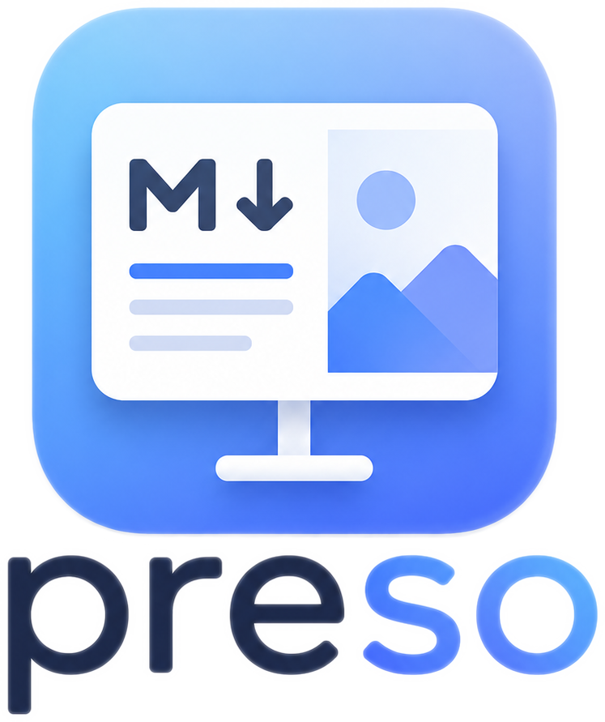

<p align="center">
  
</p>

# preso

A native markdown presentation app, written in Rust. Write your talk in a
single markdown file; present it in a dual-window setup (a clean **audience**
window plus a **presenter** view with notes, timer, and a preview of what's
next), or export it to PDF or PowerPoint.

No browser, no Electron, no network. Slides render on the GPU (wgpu) by
default, with a software rasterizer (tiny-skia) fallback via `--software` for
machines where the GPU backend misbehaves.

https://github.com/user-attachments/assets/7da56692-c420-444a-a1d0-41588eac4773

<p align="center"><a href="docs/showcase.mp4">▶ Watch the tour</a>: <a href="docs/example-talk.md"><code>docs/example-talk.md</code></a>, slide by slide, beside what preso renders.</p>

## Features

- **Plain-markdown decks** — slides separated by `---`, with YAML frontmatter.
- **Dual-window presenting** — audience window + presenter view (current slide,
  next step/slide preview, speaker notes, elapsed + countdown timer), with a
  notes-first layout for talks that lean on their notes.
- **Themes** — TOML themes (two built in: `dark`, `light`) controlling colours,
  fonts, gradients, accent bars, logos, background images, and slide numbers.
- **Slide kinds** — `title` / `section` / normal slides, each themable
  independently via `[title]` / `[section]` overlays.
- **Layouts** — two-column (`<!-- layout: TwoColumn 2:1 -->`) with per-slide
  ratios and aligned column bodies.
- **Alignment** — vertical (`align`: `top` / `center`) and horizontal
  (`halign`: `left` / `center` / `right`) per-slide or per-theme.
- **Reveal steps** — `<!-- pause -->` builds a slide up incrementally.
- **Code** — syntax highlighting, line highlighting (` ```rust {2,4-6} `), and a
  "focus mode" that dims everything except the selected lines.
- **Diagrams & math** — Mermaid and Graphviz (with transparent backgrounds),
  plus LaTeX math via `$$ … $$`.
- **Images** — sizing, borders, and drop shadows (per-image or theme-wide);
  full-bleed cover backgrounds.
- **Annotation** — laser pointer and pen drawing over the live audience window.
- **Video** — mark a slide with `<!-- video: clip.mp4 -->`; plays inline on the
  slide with the `video` feature (GStreamer), controlled from a play button and
  scrub bar in the presenter view, or via a fullscreen external player
  otherwise.
- **PDF & PowerPoint export** — one page per slide or one per reveal step, plus
  a 2-up handout layout for PDF. PowerPoint export makes each slide a
  full-bleed picture, exactly as presented. Fully headless (no window opened).
- **Importing and converting** — `preso-convert` turns a Slidev deck or a
  PowerPoint file into preso markdown, and a preso deck into Slidev or an
  editable PowerPoint.

## Installation

### Homebrew (macOS & Linux) — recommended

On **macOS** (Apple Silicon) and **Linux** (x86_64), Homebrew is the easiest
way to install and keep preso up to date. preso lives in its own
[tap](https://github.com/camjjack/homebrew-preso) — a third-party formula
repository — so you add (and thereby trust) that repository once, then install
from it:

```sh
brew tap camjjack/preso     # one-time: add & trust the preso tap
brew install preso          # the standard binary
```

For inline video playback (the `video` feature), install `preso-video`
instead — it pulls in GStreamer for you:

```sh
brew install preso-video    # inline video; GStreamer installed automatically
```

(`preso` and `preso-video` both provide the `preso` command, so install one or
the other.) The tap-then-install can also be a single qualified command, which
adds the tap implicitly:

```sh
brew install camjjack/preso/preso        # or: camjjack/preso/preso-video
```

A few things worth knowing the first time:

- **You're adding a third-party tap.** `brew tap` registers an external
  repository with Homebrew — a one-time trust step, since Homebrew runs its
  formulae. Keep it tapped: it's also how `brew upgrade` finds new preso
  releases.
- **`preso-video` sets up GStreamer for you.** It declares GStreamer (and its
  glib/gettext libraries) as Homebrew dependencies, so `brew` installs them
  alongside — nothing else to configure for inline video. Plain `preso` has no
  such dependency.
- **Platform coverage.** macOS is Apple Silicon only (there are no Intel
  release builds); Linux is x86_64 via
  [Linuxbrew](https://docs.brew.sh/Homebrew-on-Linux). On **Windows**, use a
  prebuilt binary or build from source (below).

Upgrade later with `brew upgrade preso` (or `preso-video`).

### Prebuilt binaries (all platforms)

Prebuilt binaries for macOS (Apple Silicon), Linux (x86_64), and Windows
(x86_64) are attached to each tagged release on the
[Releases page](https://github.com/camjjack/preso/releases). The binary is
self-contained (fonts and the built-in themes are embedded), so just unpack
and run it. This is the route for Windows, and for anyone not using Homebrew.
The standard archives also include `preso-convert` (see [Usage](#usage)).

Each release also ships a `-video` variant with inline video playback compiled
in (the `video` feature). Those link GStreamer, so they need it installed at run
time — see [Video](#video) for the per-platform install. (Installing via
`brew install preso-video` or the `preso-video` Debian package handles that for
you.) The plain binaries have no such dependency and fall back to an external
player for video slides. The `-video` archives don't include `preso-convert`.

### Debian / Ubuntu packages

Each release also attaches x86_64 `.deb` packages: `preso`, and `preso-video`,
whose dependencies pull in the GStreamer runtime and plugins that inline video
needs. Install one or the other (they replace each other):

```sh
sudo apt install ./preso_*_amd64.deb         # or: ./preso-video_*_amd64.deb
```

The packages install `preso` with a desktop entry and icons. They don't include
`preso-convert`, which comes in the release archives, the Homebrew `preso`
formula and the Nix flake.

### Nix

The flake builds the **video** variant and pins GStreamer as a real
dependency, so inline playback works with nothing else installed:

```sh
nix run github:camjjack/preso -- talk.md      # or:
nix profile install github:camjjack/preso
```

To make preso part of a NixOS or home-manager configuration instead, add
the flake as an input and either apply the overlay (then it's `pkgs.preso`)
or reference the package directly:

```nix
{
  inputs = {
    nixpkgs.url = "github:NixOS/nixpkgs/nixos-unstable";
    preso.url = "github:camjjack/preso";
    # Build preso with *your* nixpkgs instead of the flake's pin, so
    # GStreamer and the GUI libraries match the rest of your system:
    preso.inputs.nixpkgs.follows = "nixpkgs";
  };

  outputs = { nixpkgs, preso, ... }: {
    nixosConfigurations.myhost = nixpkgs.lib.nixosSystem {
      modules = [
        # Overlay style — preso becomes a normal pkgs attribute:
        { nixpkgs.overlays = [ preso.overlays.default ]; }
        ({ pkgs, ... }: { environment.systemPackages = [ pkgs.preso ]; })
      ];
    };
  };
}
```

With home-manager it's the same overlay plus `home.packages = [ pkgs.preso ]`,
or skip the overlay entirely and use
`preso.packages.${pkgs.system}.default` wherever a package is expected.
(The overlay builds against your nixpkgs; the direct package uses the
flake's own pin unless you add the `follows` line.)

`nix develop` gives a shell with the C-level dependencies for
`cargo build --features video` (GStreamer, pkg-config), if you'd rather use
your own toolchain.

### From source

To build from source you need a recent stable Rust toolchain (edition 2024,
Rust ≥ 1.88).

```sh
git clone https://github.com/camjjack/preso
cd preso
cargo build --release
# binary at target/release/preso
```

On Linux, install the build dependencies first (Debian/Ubuntu names — these
cover X11 clipboard support and keyboard handling; no GTK packages are needed,
and the wgpu backend uses your existing Vulkan/GL drivers at runtime):

```sh
sudo apt-get install -y \
  libxkbcommon-dev libxcb1-dev libxcb-render0-dev \
  libxcb-shape0-dev libxcb-xfixes0-dev
```

### Editor support

Every install route above also installs `preso-lsp`, a language server that
makes editors preso-aware: a slide outline, problems reported as you type,
completion, hover help, and one-command slide and layout actions. For VS Code,
install `preso-vscode-<version>.vsix` from the
[Releases page](https://github.com/camjjack/preso/releases); for Zed, the
extension is in [`editors/zed`](editors/zed). Any other editor with an LSP
client can run `preso-lsp` for markdown files. See *Editor Support* in the
guide for setup.

## Usage

```sh
preso path/to/deck.md                  # present (dual window)
preso deck.md --theme light            # built-in theme by name
preso deck.md --theme themes/mine.toml # custom theme file
preso deck.md --audience-only          # single window (rehearsing on a laptop)
preso deck.md --duration 30            # 30-minute countdown in the presenter view

# Export (headless — no window is opened):
preso deck.md --export-pdf out.pdf            # one page per slide
preso deck.md --export-pdf out.pdf --export-steps  # one page per reveal step
preso deck.md --export-pdf out.pdf --export-2up    # 2-up handout
preso deck.md --export-pptx out.pptx          # PowerPoint, one picture per slide
                                              # (--export-steps works here too)

# Convert other formats to preso markdown, or a preso deck to them:
preso-convert slides.md -o deck.md            # Slidev → preso
preso-convert talk.pptx -o deck.md            # PowerPoint → preso
preso-convert deck.md --to pptx -o deck.pptx  # preso → editable PowerPoint
preso-convert deck.md --to slidev -o slides.md
```

The renderer defaults to the GPU (wgpu) backend; both backends are compiled into
the standard binary and `--software` forces the tiny-skia software renderer at
runtime (use it if wgpu misbehaves on your GPU). Building without default
features (`cargo build --no-default-features`) drops wgpu for a software-only
binary.

### Keyboard controls

| Key | Action |
|-----|--------|
| `→` `↓` `Space` `PageDown` | Next step / slide |
| `←` `↑` `Backspace` `PageUp` | Previous |
| `Home` / `End` | First / last slide |
| digits then `Enter` | Jump to slide number |
| `Esc` | Toggle the slide overview grid |
| `f` | Toggle fullscreen |
| `n` | Switch the presenter layout (slide-first ↔ notes-first) |
| `r` | Reset the timer |
| `v` | Play/pause the current slide's video (or open it in an external player) |
| `,` / `.` | Pause an inline video and step one frame back / on |
| `l` | Toggle laser pointer (audience window) |
| `p` | Toggle pen annotation |
| `c` | Clear annotations |
| `h` | Toggle highlight authoring: in the presenter window, drag a box over an image to copy a `<!-- highlight: … -->` directive |

On a slide with an inline video, `Space` plays and pauses the clip instead of
advancing, and while it plays `←` scrubs back a few seconds (`⌥←` / `Alt+←`
rewinds to the start). The other navigation keys work as usual. See the
[keyboard reference](docs/guide/src/reference/keyboard.md) for the full
details.

## Video

Mark a slide as playable with a comment (path relative to the deck file):

```markdown
## Live demo


<!-- video: clips/demo.mp4 -->
```

How the clip plays depends on the build:

- **Inline** (on the slide, with audio) — needs a binary built with the `video`
  feature and the wgpu backend (the default). The `-video` release artifacts and
  packages, Nix, and a `cargo build --release --features video` all provide
  this. Before it plays, the slide shows the clip's first frame, or the slide's
  own image if it has one (like the poster above). <kbd>Space</kbd> or
  <kbd>v</kbd> plays and pauses it, and pausing holds the current frame. The
  presenter view shows the clip too, with a play/pause button and a scrub bar to
  drag through it.
- **External** — the plain binaries (and any run with `--software`) show the
  slide with a ▶ badge, and <kbd>v</kbd> hands the clip to a fullscreen external
  player: [`mpv`](https://mpv.io) if it's on your `PATH` (recommended),
  otherwise the OS default opener.

Inline playback decodes via GStreamer, so a `video` build needs the GStreamer
runtime installed to **build and run** — including for the prebuilt `-video`
binaries. (Installing with `brew install preso-video`, the `preso-video`
Debian package or Nix is the exception: each declares GStreamer as a
dependency, so it's set up automatically and you can skip this section.)
Otherwise, per platform:

- **macOS** — `brew install gstreamer` (or the official framework from
  [gstreamer.freedesktop.org](https://gstreamer.freedesktop.org/download/)).
  Building from source also needs the dev files and pkg-config:
  `brew install gstreamer pkg-config`.
- **Linux (Debian/Ubuntu)** — the runtime + plugins, including `libav` for
  H.264/AAC (most `.mp4` clips):
  `sudo apt-get install -y gstreamer1.0-plugins-base gstreamer1.0-plugins-good gstreamer1.0-plugins-bad gstreamer1.0-plugins-ugly gstreamer1.0-libav`.
  Building from source additionally needs
  `libgstreamer1.0-dev libgstreamer-plugins-base1.0-dev`.
- **Windows** — install the **MSVC runtime** package from
  [gstreamer.freedesktop.org/download](https://gstreamer.freedesktop.org/download/)
  (choose *complete* so the plugins are included). Building from source needs the
  **development** package plus `pkg-config` on `PATH`, and the env var
  `GSTREAMER_1_0_ROOT_MSVC_X86_64` pointing at the install root
  (e.g. `C:\Program Files\gstreamer\1.0\msvc_x86_64`).

The plain (non-`video`) binaries have no GStreamer dependency. See
[`docs/guide/src/writing/video.md`](docs/guide/src/writing/video.md) for the full
details.

## Writing a deck

````markdown
---
title: My Talk
theme: dark
---

<!-- slide: kind=title halign=center -->
# My Talk
## A subtitle

---

## A normal slide

- A point
- Another point
<!-- pause -->
- Revealed on the next step

<!-- note: remember to mention the demo here -->

---

<!-- layout: TwoColumn 2:1 -->

## Left column

```rust {2}
fn main() {
    println!("highlighted line");
}
```
*** 

## Right column

Text on the right.
````

See [`docs/example-talk.md`](docs/example-talk.md) for a full worked deck and
[`docs/themes/corporate.toml`](docs/themes/corporate.toml) for an annotated
theme.

## Project layout

| Crate | Responsibility |
|-------|----------------|
| `preso-core` | Markdown deck parser and document model |
| `preso-style` | TOML theme model and the built-in themes |
| `preso-diagram` | Mermaid / Graphviz / LaTeX-math rendering to images |
| `preso-export` | PDF and bitmap-PPTX assembly |
| `preso-app` | The `preso` binary: iced GUI, presenter view, PDF and PowerPoint export |
| `preso-convert` | The `preso-convert` binary: Slidev and PowerPoint to preso markdown, and preso to Slidev or editable PowerPoint |

## License

Dual-licensed under either of

- Apache License, Version 2.0 ([LICENSE-APACHE](LICENSE-APACHE))
- MIT license ([LICENSE-MIT](LICENSE-MIT))

at your option. This is the standard Rust-ecosystem convention: you may use the
project under whichever of the two licenses suits you.
