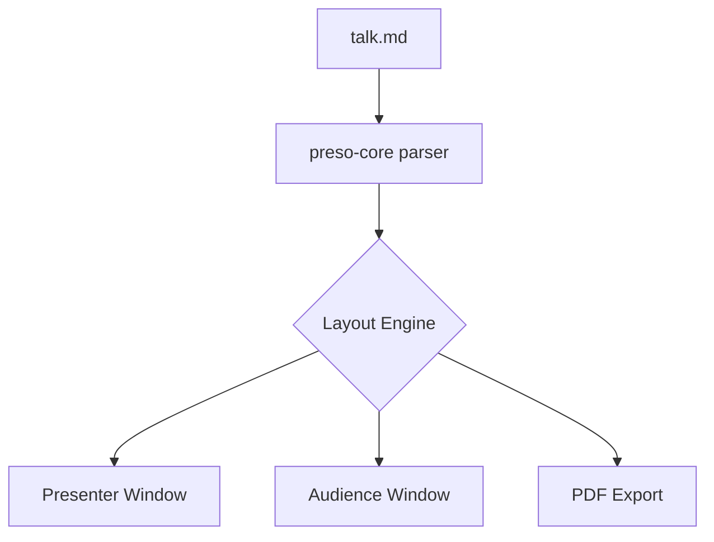
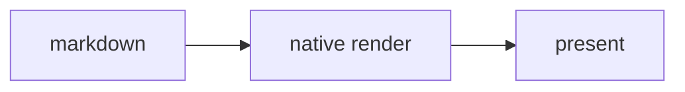
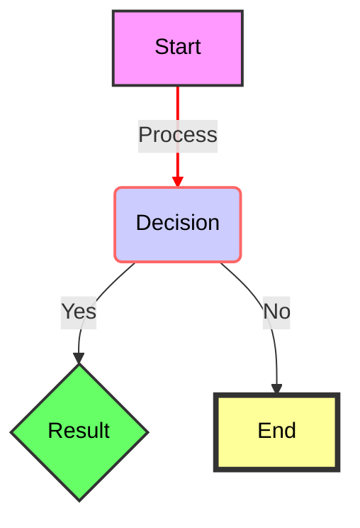
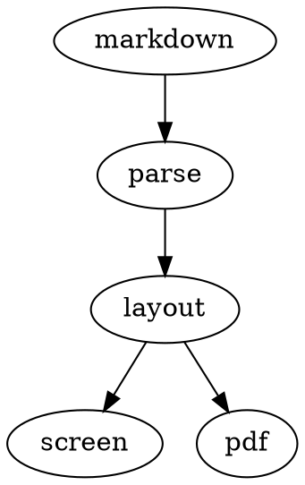

<!-- slide: kind=title -->
<!-- note: Welcome everyone. Introduce yourself and the project. -->

# Preso

**Native** markdown presentations in *Rust* — no browser, no Electron, just `cargo run` 🚀

---

## Why Another Tool?

- Slidev and Marp need a browser runtime
<!-- pause -->
- Terminal tools can't render images or math
<!-- pause -->
- We want **native windows**, *fast startup*, and [open source](https://github.com/camjjack/preso)

<!-- note: Pause on each point. The third reveals the link — clickable in presenter only. -->
<!-- note[2]: Mention presenterm as good prior art before moving on. -->

---

## Code with Highlighting

```rust {all|2|4-6}
fn main() {
    let deck = Deck::load("talk.md").unwrap();
    for slide in deck.slides() {
        println!("{}", slide.title());
        render(slide);
        sync_windows(slide);
    }
}
```
---

<!-- layout: TwoColumn -->
<!-- note: One column has a heading, the other doesn't — the bodies still line up under a shared header band. (A slide-level ## title would become the left column's heading, so two-column slides skip it.) -->

## The Problem

Browser-based tools are heavy. A blank Slidev deck uses ~400 MB of RAM.

***

A native binary does the same job in a fraction of the footprint — and
this prose lines up with the left body, not the heading above it.

---

<!-- layout: TwoColumn -->
<!-- note: Matching headings on both sides: headings align, bodies align. -->

### Before

Browser runtime, hundreds of MB idle, slow cold start, a packaging story
that involves shipping Chromium.

***

### After

One native binary. Instant start, a few MB of RAM, `cargo install` and go.

---

<!-- slide: kind=section -->
<!-- note: Section headers get their own [section] theme treatment. -->

# Rich Content

---

## Architecture



---

## Transparent Diagrams

The `transparent` flag drops the light card — the diagram sits
straight on the slide background:



<!-- note: Works for dot/graphviz fences too: {width=45% transparent}. -->

---

## Transparent Diagrams2


---

## Graphviz Too

Classic DOT, rendered in pure Rust — no `dot` binary required:



<!-- note: The width=45% fence annotation sizes the diagram, same as Mermaid. -->

---

## The Math Works Too

Inline: the discriminant $b^2 - 4ac$ decides everything.

Display:

$$
x = \frac{-b \pm \sqrt{b^2 - 4ac}}{2a}
$$

And a matrix:

$$
\begin{pmatrix} a & b \\ c & d \end{pmatrix}
\begin{pmatrix} x \\ y \end{pmatrix}
=
\begin{pmatrix} ax + by \\ cx + dy \end{pmatrix}
$$

---

## Tables

Headers, row separators, and per-column alignment all render:

| Component       | Lines | Status |
|:----------------|------:|:------:|
| Parser          |   980 |   ✓    |
| Renderer        |  1240 |   ✓    |
| `preso-convert` |   620 |   ✓    |

Left text, right-aligned numbers, centred status — set with `:---`, `---:`, `:--:`.

---

## Edge Cases Live Here

This slide contains a horizontal rule inside a code block — it must NOT split:

```markdown
front part

---

back part
```

Inline `code with **not bold** inside`, an image, and unicode: 中文, العربية, emoji 🎉

{width=25% border shadow}

---

<!-- slide: background=assets/backdrop.png align=center -->
<!-- note: A full-bleed background image, cover-fit over the whole canvas. The value is a path instead of a #hex color; content renders on top. A theme can set one deck-wide with [slide] background_image. -->

# Full-Bleed Backgrounds

`background=image.png` covers the whole slide — text renders on top.

---

<!-- slide: align=center background=#11111b -->

# Thanks!

Questions? → [github.com/camjjack/preso](https://github.com/camjjack/preso)

<!-- note: Leave this up during Q&A. Remember to stop the timer. -->
