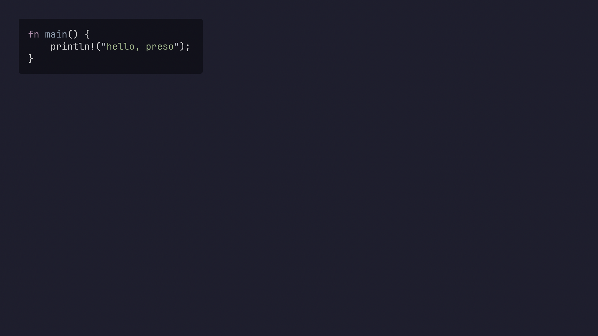

# Code Blocks

Fenced code blocks are syntax-highlighted by language, using the theme's
`code_theme`:

````markdown
```rust
fn main() {
    println!("hello, preso");
}
```
````



## Line highlighting

Add a `{…}` annotation after the language to emphasise specific lines —
individual lines and ranges, comma-separated:

````markdown
```rust {2,4-6}
fn main() {
    let xs = vec![1, 2, 3];
    let total: i32 = xs.iter().sum();
    println!("sum = {total}");
}
```
````

## Click-through highlighting

List several highlight stages separated by `|`, and each press reveals the next
one — a code walkthrough that advances as you click. `all` (or `none`) clears
the highlight:

````markdown
```rust {2-3|5|all}
fn main() {
    let xs = vec![1, 2, 3];
    let total: i32 = xs.iter().sum();
    println!("ready");
    println!("sum = {total}");
}
```
````

That slide highlights lines 2–3, then line 5, then nothing — over three
presses. Click-through stages count as [reveal steps](reveal-steps.md), so they
share the same step counter as your `<!-- pause -->` builds.

## Font size

One oversized listing that won't fit? Add `size=NN` to the fence annotation to
set that block's code font size, in [design units](../theming/basics.md#design-units),
overriding the theme's `code_size` for that block only:

````markdown
```python {size=20}
def a_long_function(...):
    ...
```
````

The theme's `code_size` (e.g. `30`) is the default, so a smaller number
shrinks the block (the panel padding scales with it). It combines with line
highlights in the same annotation, e.g. `` ```rust {2,4-6 size=22} ``.

## Focus mode

By default the highlighted lines get a background tint. A theme can instead
**dim everything except** the highlighted lines (`highlight_style = "dim"`),
which reads as a spotlight on the lines you're talking about. That's a theme
setting — see [Element Styles](../theming/elements.md#code-blocks).

To override the theme's choice for **one block**, add a bare `dim` or
`background` flag to its annotation — handy when a deck defaults to `dim` but
one block reads better with a tint (or vice versa):

````markdown
```rust {3 background}
let highlighted = "with a tint, even though the theme dims";
```
````

## Panel width and alignment

A code block's background hugs its content (the longest line) with even
padding, rather than stretching the full slide width; a block wider than the
slide is capped at the content width.

To override that, add `width=NN%` — a percentage of the content width.
`width=100%` makes the panel full width (the old behaviour), `width=50%` half:

````markdown
```python {width=100%}
print("full-width panel")
```
````

By default the panel sits at the left. Add `align=center` or `align=right` to
place it across the slide (a centre/right-aligned slide already does this to
all its content; the flag sets it per block):

````markdown
```python {align=center}
print("centered in the page")
```
````
