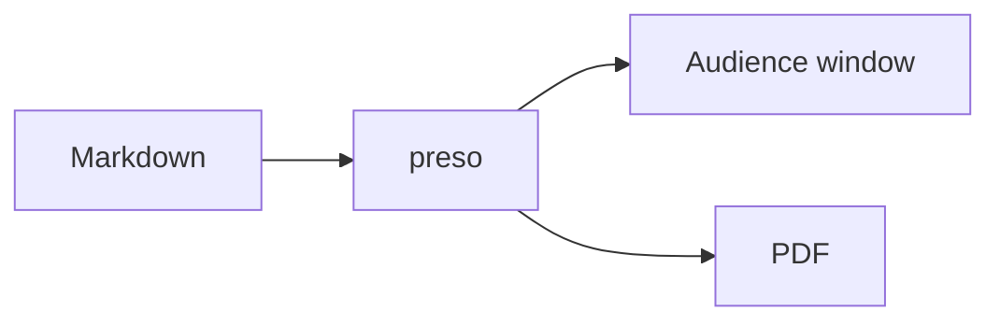
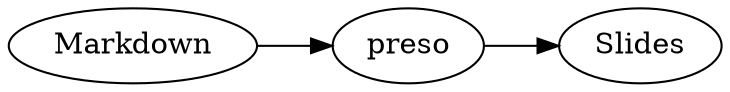
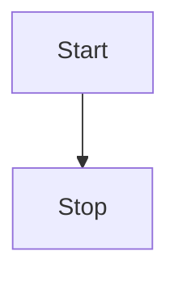

# Diagrams

preso renders [Mermaid](https://mermaid.js.org) and
[Graphviz](https://graphviz.org) diagrams from fenced code blocks — no external
tools, it's all built in.

## Mermaid

````markdown

````


## Graphviz

Use a `dot` fence for Graphviz:

````markdown

````


## Sizing and transparent backgrounds

Both accept the same `{…}` annotation as other blocks:

- `{width=60%}` — size the diagram to a percentage of the content width.
- `{transparent}` — drop the diagram's light card and render straight onto the
  slide background. Especially useful on dark or gradient themes.

````markdown

````

The two compose: `{width=60% transparent}` does both.
