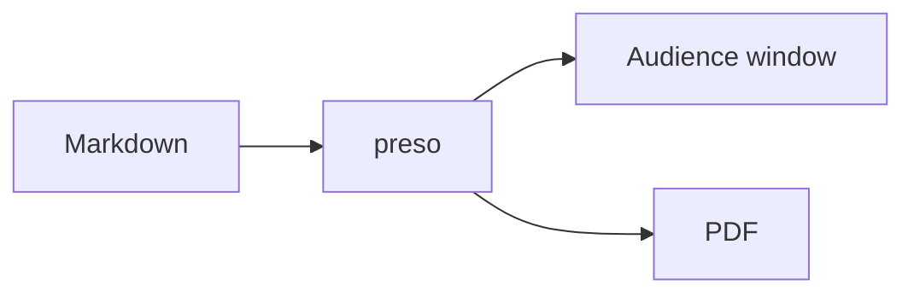
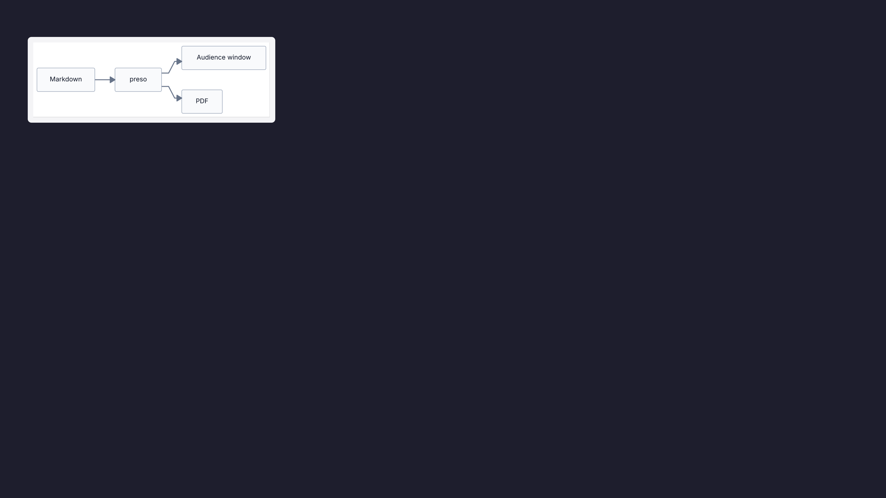
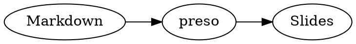
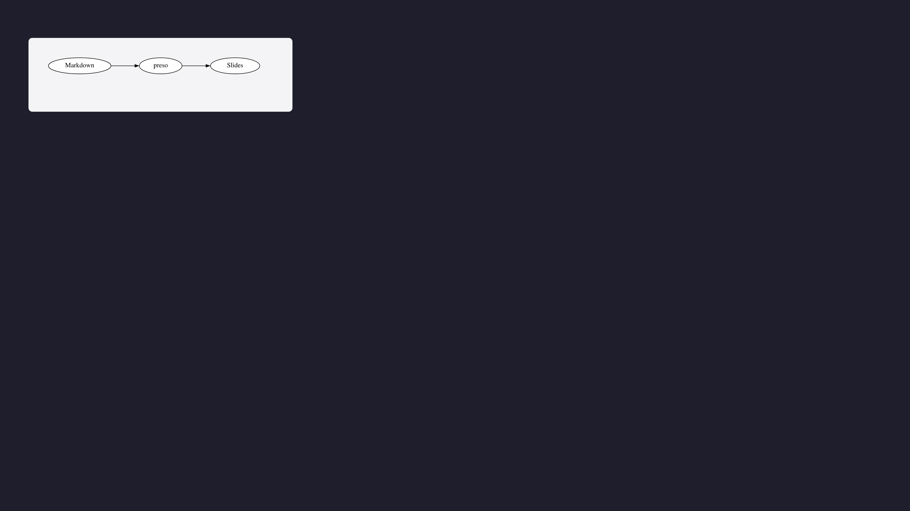
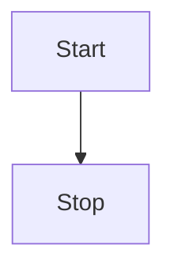
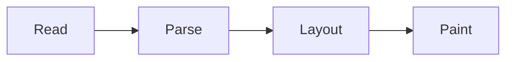

# Diagrams

preso renders [Mermaid](https://mermaid.js.org) and
[Graphviz](https://graphviz.org) diagrams from fenced code blocks — no external
tools, it's all built in.

## Mermaid

````markdown

```mermaid
flowchart LR
    A[Markdown] --> B[preso]
    B --> C[Audience window]
    B --> D[PDF]
```
````



## Graphviz

Use a `dot` fence for Graphviz:

````markdown

```dot
digraph {
    rankdir=LR
    Markdown -> preso -> Slides
}
```
````



## Sizing and transparent backgrounds

Both accept the same `{…}` annotation as other blocks:

- `{width=60%}` — size the diagram to a percentage of the content width.
- `{transparent}` — drop the diagram's light card and render straight onto the
  slide background. Especially useful on dark or gradient themes.

````markdown

```mermaid {width=70% transparent}
flowchart TD
    Start --> Stop
```
````

The two compose: `{width=60% transparent}` does both.

## Zooming onto nodes

Like a code block's [line zoom](code.md#zooming-onto-lines), a `zoom` flag
turns the annotation's `|`-separated stages into zoom targets — here, the
**labels** of the nodes to zoom onto:

````markdown

```mermaid {width=100% all|Layout|Read, Parse zoom}
graph LR
    a[Read] --> b[Parse] --> c[Layout] --> d[Paint]
```
````

That opens on the whole diagram, zooms onto the `Layout` node, then pans out
to fit `Read` and `Parse` together (commas zoom onto several nodes at once).
Labels match case-insensitively; a subgraph's title zooms onto the whole
subgraph. A label that matches nothing leaves the diagram whole. A zooming
diagram is rasterized at extra depth so it stays sharp as it zooms (up to 4×);
a very large one — a full-width diagram, say — gets less, so it can soften a
little at its deepest zoom.

As with code, the zooming diagram claims the rest of the slide below it as
room to zoom into.
