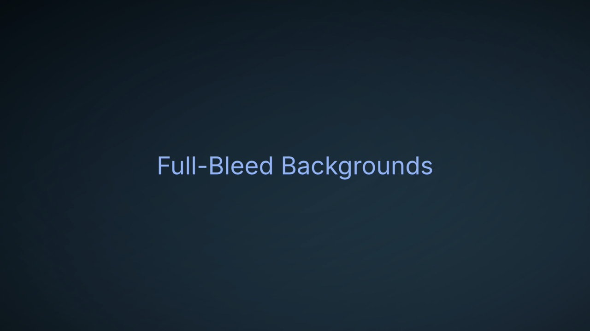

# Images & Backgrounds

## Content images

Standard markdown image syntax; the path is resolved relative to the deck file:

```markdown

```

### Sizing and framing

Add a `{…}` attribute group to size and frame an image:

```markdown
{width=25% border shadow}
```

| Attribute | Effect |
|-----------|--------|
| `width=NN%` | Width as a percentage of the content area. |
| `align=left\|center\|right` | Horizontal position of the image (default `left`). |
| `border` | Draw a border (colour/size from the theme). |
| `shadow` | Draw a drop shadow. |
| `plain` | Strip the theme's default border/shadow for this image. |

Attributes combine in any order, e.g. `{width=40% align=center shadow}`.

Whether `border`/`shadow` are on by default comes from the theme's `[image]`
section; the flags above override per-image. See
[Element Styles](../theming/elements.md#images).

`align` positions the image regardless of the slide's text alignment, so you
can keep a left-aligned slide but centre a diagram. (A centre/right-aligned
slide already centres/right-aligns its images; `align` lets you set it per
image.)

### Side-by-side rows

Put images on **consecutive lines** (no blank line between) to lay them out
in a row instead of stacked — handy for a before/after pair or a small
gallery:

```markdown


```

They share the content width equally, each centred in its share. A blank line
ends the row, so this stacks the two images vertically:

```markdown


```

Any number of adjacent images row together; `{width=NN%}` still applies per
image (capped to its share of the row).

By default the images share the width equally (each centred in its slot). Add
`{fit}` to make the row instead pack the images at their **actual width**,
centred as a group — put it on any one image in the row:

```markdown
{width=20% fit}
{width=20%}
```

## Crediting images

To attribute images — a photo credit or a Creative Commons licence — add a
`<!-- footnote: … -->` directive. It renders one small, muted line along the
bottom of the slide, so a single disclaimer can cover everything on it:

```markdown
## Wildlife


<!-- footnote: Photos: J. Doe (fox), A. Lee (heron) — CC BY 4.0 -->
```

The text is plain (write URLs out in full, e.g.
`creativecommons.org/licenses/by/4.0`). Multiple `footnote` directives on one
slide are joined into a single line. Style it — size, colour, font, alignment,
position — with the theme's [`[footnote]`](../theming/chrome.md#footnote)
section; a kind overlay can hide it (e.g. on title slides).

## Full-bleed backgrounds

Give a single slide a cover-fit background image with the `background=`
directive (a path, rather than a `#hex` colour). Content renders on top, so it
doubles as a "text over photo" slide:

```markdown
<!-- slide: background=images/backdrop.jpg align=center halign=center -->

# Full-Bleed Backgrounds
```



To set a background image for the **whole deck** instead of one slide, use the
theme's `[slide] background_image`. A solid per-slide colour uses the same
directive with a hex value: `<!-- slide: background=#101418 -->`. See
[Slide Chrome](../theming/chrome.md).

## Positioned images (behind the text)

A full-bleed background covers the slide; for an image placed at a *spot* —
behind the text rather than after it — use the `<!-- image: … -->` directive.
It draws on a layer above the background but **below the content**, so any
overlapping text stays readable on top (much like the theme logo, but authored
per slide and you can have several):

```markdown
<!-- image: diagrams/architecture.png position=center width=60 opacity=0.4 -->

## Architecture

- The diagram sits behind these points
```

| Parameter | Meaning | Default |
|-----------|---------|---------|
| (first token) | Image path, deck-relative | — |
| `position` | `center`, `top`/`bottom`/`left`/`right`, or a corner (`top-left`, `bottom-right`, …) | `center` |
| `width` | Percent of the slide width (`width=60` or `60%`); omit for natural size | natural |
| `opacity` | `0.0`–`1.0` | `1.0` |
| `padding` | Inset from the anchored edges, design units | `0` |
| `padding-left` / `-right` / `-top` / `-bottom` | Per-side inset; overrides `padding` for that side | `padding` |

Repeat the directive for several images on one slide. Unlike a `` image,
these don't take part in the content flow — they're placed by `position`, not
stacked after the text.

Like the slide content, a positioned image stays clear of any
[accent bar](../theming/chrome.md#accent-bars) marked `reserve = true` — so
`position=right` sits just left of a reserved right bar rather than under it.
