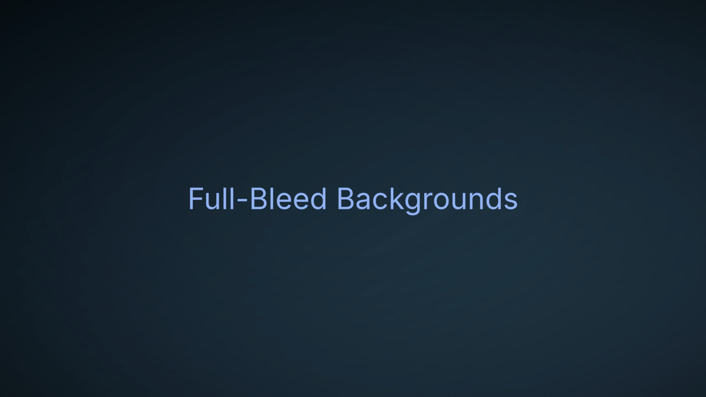

# Images & Backgrounds

## Content images

Standard markdown image syntax; the path is resolved relative to the deck file:

```markdown

```

An **SVG** is rasterised at the size it's drawn, so it stays crisp at any
scale. One thing to watch for, in files exported from PowerPoint especially:
if the file hard-codes `width`/`height` with no `viewBox`, that canvas was
measured for the exact fonts it was authored with. Where a font isn't
installed here, the substitute is usually wider, the text overruns the
canvas, and the file's own canvas clips it — an edge sliced off that no
`{width=NN%}` will fix, because the clipping happens inside the SVG's
coordinate space. preso warns when it sees this:

```text
WARN preso::media: SVG content is clipped by the canvas the file itself
declares (4 past the right, in the file's own units)…  image="ipv4.svg"
```

Widen `width`/`height` on the `<svg>` element to suit (the coordinates don't
change, so nothing moves or rescales — there's just room now), or convert the
text to paths when exporting, which removes the font dependency altogether.

### Fonts an SVG names

An SVG sets its text in whatever font it names, and preso can only use fonts
that are installed (plus the ones it bundles). Where a named font is missing,
preso substitutes its own sans — and says so:

```text
WARN preso::media: SVG asks for `Arial` — not installed here, so its text is
set in a substitute instead…  image="diagram.svg"
```

This matters most in **CI**, where a runner typically has almost no fonts. A
file naming `Arial` with no fallback renders fully on a Mac and, without the
substitution, would render as shapes with no text at all on a Linux runner —
because an SVG renderer drops text it can't find a font for. preso fills that
gap, so a deck builds the same everywhere; the labels are just set in a
different face, and the metrics differ enough that content can overrun the
canvas (the warning above).

To keep the original face, either install it on the machine doing the
rendering, or remove the dependency at the source:

- add a generic fallback, `font-family="Arial, sans-serif"`, so the intent is
  in the file;
- or export the SVG with its text converted to paths, which pins the exact
  shapes and needs no font anywhere.

An **animated GIF** plays on the slide, looping. Be aware of what that costs:
a GIF's frames are stored as deltas but *decode* to the whole canvas, so a
1920×1018 capture is 7.5 MB a frame however small the file looks — a 70-second
recording at 30fps wants some 16 GB. preso holds at most 256 MB of frames and
drops the rest, spreading what it keeps across the whole animation and warning
you (`preso deck.md` prints it on stderr). The result plays steadily but
choppily. For a screen recording, convert it to a video instead and use
[`<!-- video: … -->`](video.md), which plays at full rate from a much smaller
file:

```sh
ffmpeg -i capture.gif -movflags +faststart -pix_fmt yuv420p capture.mp4
```

### Sizing and framing

Add a `{…}` attribute group to size and frame an image:

```markdown
{width=25% border shadow}
```

| Attribute | Effect |
|-----------|--------|
| `width=NN%` | Width as a percentage of the content area. |
| `align=left\|center\|right` | Horizontal position of the image (default `left`). |
| `border` | Draw a border (colour/size from the theme). |
| `shadow` | Draw a drop shadow. |
| `plain` | Strip the theme's default border/shadow for this image. |

Attributes combine in any order, e.g. `{width=40% align=center shadow}`.

Whether `border`/`shadow` are on by default comes from the theme's `[image]`
section; the flags above override per-image. See
[Element Styles](../theming/elements.md#images).

`align` positions the image regardless of the slide's text alignment, so you
can keep a left-aligned slide but centre a diagram. (A centre/right-aligned
slide already centres/right-aligns its images; `align` lets you set it per
image.)

### Side-by-side rows

Put images on **consecutive lines** (no blank line between) to lay them out
in a row instead of stacked — handy for a before/after pair or a small
gallery:

```markdown


```

They share the content width equally, each centred in its share. A blank line
ends the row, so this stacks the two images vertically:

```markdown


```

Any number of adjacent images row together; `{width=NN%}` still applies per
image (capped to its share of the row).

By default the images share the width equally (each centred in its slot). Add
`{fit}` to make the row instead pack the images at their **actual width**,
centred as a group — put it on any one image in the row:

```markdown
{width=20% fit}
{width=20%}
```

### An image with text beside it

Write text **after** an image on the same line and the two render side by
side, the text vertically centred against the image — an icon with its label,
say. Consecutive lines stack tight, so a run reads as a list:

```markdown
{width=6%} Start a capture
{width=6%} Stop a capture — don't forget, or your disk fills up
{width=6%} Restart a capture
```

Give the images a `{width=NN%}` and the labels share a left edge: the image
column takes the widest of them. Without one, each image keeps its natural
size (capped at half the content width so the label always has room) and each
label starts right after its own image, so they won't line up.

The label takes the same inline markdown a table cell does — `` `code` ``,
`**bold**`, `==marks==`, and `<br>` for a second line.

The image doesn't have to come first. Text on either side of it stays beside
it, so an icon can trail its label or sit mid-sentence:

```markdown
Launched by the bug icon {width=4%}

Press {width=4%} to start debugging
```

Text *before* the image rules out the shared left edge, though — what starts
the row is then the text, whose width isn't known until it lays out.

This works inside a list too, where it's most useful: the bullet stays a
bullet, at whatever nesting level, and only the item's content is laid out as
image-and-text.

```markdown
- Launched by the bug icon {width=4%}
- {width=4%} Or press F5
  - Nested items work the same {width=4%}
```

The one line that isn't picked up is one holding **two** images (or an image
and a link) — that stays ordinary markdown, where the text will break around
the images.

## Highlighting parts of an image

To call out a region of an image — one field of a protocol diagram, one box
of an architecture chart — add a `<!-- highlight: … -->` directive on the
line(s) before it. A translucent shape draws **over the image**, so one
master image can serve a whole run of slides, each spotlighting a different
element:

```markdown
## The version field

<!-- highlight: rect x=2% y=20% w=15% h=27% -->

```

The first token is the shape — `rect` or `ellipse` (`circle` is an alias) —
followed by `key=value` parameters:

| Parameter | Meaning | Default |
|-----------|---------|---------|
| `x`, `y` | Top-left corner of the region, as a percent of the **image** (not the slide) | `0` |
| `w`, `h` | Region size, percent of the image; an ellipse inscribes the `w`×`h` box | — (required) |
| `color` | `#hex` or a theme palette name (`accent`, `text`, `heading`, `link`, `muted`) | `accent` (fill), black (spotlight) |
| `opacity` | Fill/scrim opacity, `0.0`–`1.0` (`0` for outline-only) | `0.35` (`1.0` for `under`) |
| `stroke` | Outline width in design units; `0` = no outline | `0` |
| `mode` | `fill` (translucent shape over the region), `spotlight`, or `under` (see below) | `fill` |
| `clip` | *(flag)* Confine a fill/spotlight wash to the image's opaque pixels — see [Clipping to a transparent image](#clipping-to-a-transparent-image) | off |

Because the coordinates are relative to the image itself, the same numbers
hold at any rendered size — `{width=NN%}`, two-column layouts, and PDF export
all keep the highlight on its target. Repeat the directive to draw several
shapes on one image; on a [side-by-side row](#side-by-side-rows), highlights
attach to the row's first image.

### Spotlight mode

A filled shape is translucent glass: the covered region shifts toward the
fill color, which can read as washing the image out. `mode=spotlight` (or a
bare `spotlight` flag) inverts that — everything on the image **except** the
region dims under a scrim, and the region itself is left untouched, at full
fidelity:

```markdown
<!-- highlight: rect x=17% y=18% w=21% h=30% spotlight -->

```

With no `color` the scrim is black; `color`/`opacity` restyle it. `stroke`
outlines the hole. Several spotlight shapes on one image punch holes in a
single scrim (the first one's color/opacity styles it), so a step-gated
sequence opens one more hole per ▸ press.

### Under mode (transparent images)

For an image with a transparent background — exported line art, a schematic,
a logo — the best highlight is a solid patch **behind** the image:
`mode=under` (or a bare `under`/`behind` flag) draws the shape on a layer
below it, so the color shows through the clear pixels like a marker stroke
behind ink, and the opaque artwork itself is completely untouched:

```markdown
<!-- highlight: rect x=27% y=17% w=21% h=39% under color=#ffd54a -->

```

`opacity` defaults to `1.0` in this mode (full-strength marker); on a fully
opaque image an `under` shape is invisible. Under, fill, and spotlight
shapes can mix on one image, and `highlight[n]:` step-gates them all the
same way.

### Clipping to a transparent image

Fill and spotlight washes are drawn as a rectangle (or ellipse) over the
image's whole bounding box. If the image has transparency — a logo, a
diagram with margins — the wash also tints or dims the slide background
showing through those clear areas, so a spotlight becomes an ugly dark
rectangle instead of following the artwork.

Add the `clip` flag to confine the wash to the image's **opaque pixels**,
leaving the transparent areas (and the slide background behind them)
untouched:

```markdown
<!-- highlight: rect x=5% y=15% w=35% h=70% spotlight clip -->

```

`clip` works with both `fill` and `spotlight`, and combines with the mode
token in any order. It has no effect on `under` (which already leaves the
artwork alone) and is not supported on animated GIFs (they keep the
rectangular wash). A clipped wash carries no `stroke` outline — an outline
would trace the rectangle/ellipse, not the image's silhouette; use an
un-clipped highlight if you want a crisp box.

> How it works: preso bakes the clipped wash into the image's pixels
> (respecting its alpha channel) rather than drawing a canvas rectangle, so
> it's pixel-exact and works identically in the windows and in PDF/PPTX
> export.

### Drawing a highlight with the mouse

Rather than guessing the `x`/`y`/`w`/`h` percentages, you can draw them. In
the **presenter** window, press <kbd>h</kbd> to enter highlight-author mode,
then drag a box over any image on the current slide. On release, preso copies
the matching directive to your clipboard —

```markdown
<!-- highlight: rect x=12% y=20% w=15% h=27% -->
```

— ready to paste on the line above the image. The coordinates are measured
against the image, so they keep working at any size, and existing highlights
stay visible while you add more. Press <kbd>h</kbd> again (or switch to the
laser/pen) to leave the mode. It's a `rect` fill by default; edit the pasted
directive for an `ellipse`, a `spotlight`, `under`, or a `color`.

### Stepping through highlights

`highlight[n]:` reveals a shape at step `n` (0-based, like `note[n]`), and
step-gated highlights mint reveal steps on their own — no `<!-- pause -->`
needed. So one slide can walk an image element by element:

```markdown
<!-- highlight: rect x=2% y=20% w=15% h=27% -->
<!-- highlight[1]: rect x=18% y=20% w=20% h=27% color=#e8443c -->
<!-- highlight[2]: ellipse x=55% y=55% w=45% h=35% opacity=0.2 stroke=3 -->

```

Each ▸ press adds the next shape (earlier ones stay visible). Alternatively,
put one plain `highlight:` per slide and repeat the image across slides —
same effect, one slide per element.

## Crediting images

To attribute images — a photo credit or a Creative Commons licence — add a
`<!-- footnote: … -->` directive. It renders one small, muted line along the
bottom of the slide, so a single disclaimer can cover everything on it:

```markdown
## Wildlife


<!-- footnote: Photos: J. Doe (fox), A. Lee (heron) — CC BY 4.0 -->
```

The text is plain (write URLs out in full, e.g.
`creativecommons.org/licenses/by/4.0`). Multiple `footnote` directives on one
slide are joined into a single line. Style it — size, colour, font, alignment,
position — with the theme's [`[footnote]`](../theming/chrome.md#footnote)
section; a kind overlay can hide it (e.g. on title slides).

## Full-bleed backgrounds

Give a single slide a cover-fit background image with the `background=`
directive (a path, rather than a `#hex` colour). Content renders on top, so it
doubles as a "text over photo" slide:

```markdown
<!-- slide: background=images/backdrop.jpg align=center halign=center -->

# Full-Bleed Backgrounds
```



### Fitting the image

By default the image **covers** the slide: it fills the frame and whatever
overhangs is cropped. That's what a landscape photo with room to spare wants,
and what a square one suffers — on a 16:9 slide, cover crops the top and
bottom away.

`fit=contain` scales the whole picture in instead, so nothing is lost:

```markdown
<!-- slide: background=diagram.png fit=contain -->
```

What the picture doesn't reach then shows the theme's background colour. Set
something else with `fill=`:

```markdown
<!-- slide: background=diagram.png fit=contain fill=#101418 -->
```

| `fit=` | Result |
|--------|--------|
| `cover` | Fills the slide, crops the overhang. The default. |
| `contain` (or `fit`) | Scales the whole image in; `fill=` shows around it. |
| `stretch` (or `fill`) | Stretches to the slide, distorting the image. |
| `none` | The image's own pixels, centred, neither grown nor shrunk. |

`fill=` applies to any fit that can leave the canvas uncovered, and is ignored
by `cover`, which never does.

Such a slide shows **no accent bars**. The theme's bars are how it dresses its
own background, and this slide has replaced the background outright — a band of
accent colour across a photo reads as a rendering fault rather than a design.
Dropping them also releases the space they
[reserve](../theming/chrome.md#accent-bars), so the picture gets the whole
canvas and the content sits on it rather than around where a bar would be.

To set a background image for the **whole deck** instead of one slide, use the
theme's `[slide] background_image` — that pairing is the theme author's own, so
it keeps its bars. A solid per-slide colour uses the same directive with a hex
value: `<!-- slide: background=#101418 -->`, and keeps its bars too, being the
theme's own background in another colour. See
[Slide Chrome](../theming/chrome.md).

## Positioned images (behind the text)

A full-bleed background covers the slide; for an image placed at a *spot* —
behind the text rather than after it — use the `<!-- image: … -->` directive.
It draws on a layer above the background but **below the content**, so any
overlapping text stays readable on top (much like the theme logo, but authored
per slide and you can have several):

```markdown
<!-- image: diagrams/architecture.png position=center width=60 opacity=0.4 -->

## Architecture

- The diagram sits behind these points
```

| Parameter | Meaning | Default |
|-----------|---------|---------|
| (first token) | Image path, deck-relative | — |
| `position` | `center`, `top`/`bottom`/`left`/`right`, or a corner (`top-left`, `bottom-right`, …) | `center` |
| `width` | Percent of the slide width (`width=60` or `60%`); omit for natural size | natural |
| `opacity` | `0.0`–`1.0` | `1.0` |
| `padding` | Inset from the anchored edges, design units | `0` |
| `padding-left` / `-right` / `-top` / `-bottom` | Per-side inset; overrides `padding` for that side | `padding` |

Repeat the directive for several images on one slide. Unlike a `` image,
these don't take part in the content flow — they're placed by `position`, not
stacked after the text.

Like the slide content, a positioned image stays clear of any
[accent bar](../theming/chrome.md#accent-bars) marked `reserve = true` — so
`position=right` sits just left of a reserved right bar rather than under it.
