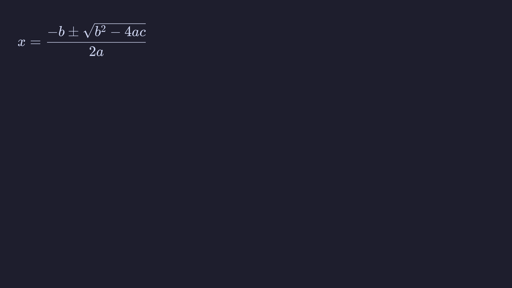

# Math

preso renders LaTeX math.

## Display math

A `$$ … $$` block renders on its own line, following the slide's alignment
(left by default). It can be on one line or span several:

```markdown
$$
x = \frac{-b \pm \sqrt{b^2 - 4ac}}{2a}
$$
```



Matrices, fractions, sums, Greek, and the usual LaTeX constructs all work:

```markdown
$$
\begin{pmatrix} a & b \\ c & d \end{pmatrix}
\begin{pmatrix} x \\ y \end{pmatrix}
=
\begin{pmatrix} ax + by \\ cx + dy \end{pmatrix}
$$
```

## Inline math

Wrap an expression in single `$` to set it inline with the text:

```markdown
The discriminant $b^2 - 4ac$ decides how many real roots there are.
```

Math is rendered in the theme's text colour, so it sits naturally in body
copy and headings.

### Literal dollar signs

preso only reads `$ … $` as math when the line has an even number of them and
the text between is non-empty with no space at either end, so ordinary prose
is usually safe on its own:

```markdown
It costs $5 and $6 respectively.   <!-- currency: the spaces give it away -->
Set $HOME and $PATH first.         <!-- likewise -->
```

Where those rules can't tell — `$100-$200` and `awk '{print $1-$2}'` have no
spaces to go on, so they *would* be read as math — escape the dollars with a
backslash:

```markdown
The range is \$100-\$200.
```

The `\$` renders as a plain `$`, and escaping one of a pair is enough to leave
the other literal too, since nothing remains for it to close against.

**Code needs no escaping.** A fenced block is verbatim, and so is an inline
span in backticks — dollars there are code, however they pair up:

```markdown
Load word: `lw $t0,0($s0)`
```

The same goes for `==`, so a `` `a==b` `` comparison in backticks isn't read
as a highlight.
