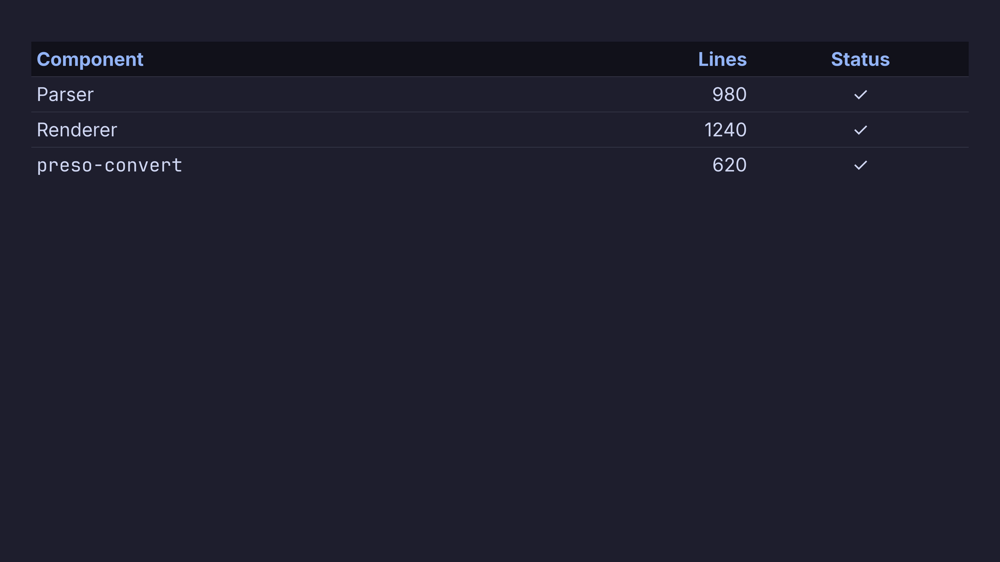

# Text, Lists & Tables

Slide bodies are ordinary markdown, so most of what you already know works.

## Text and lists

```markdown
## A slide

Paragraphs, **bold**, *italic*, `inline code`, and [links](https://example.com).

- Bullet lists
- with **inline** formatting
  - and nested items

1. Ordered lists
2. too
```

Headings set the slide's structure: a leading `#`/`##`/`###` is the slide
title, and its level also drives [two-column header alignment](two-columns.md)
and [slide-kind](slide-kinds.md) styling.

### Spacing bullets into groups

A **blank line between bullets adds a gap** — no directive needed. Bullets with
no blank line between them stay tight; a blank line inserts a line break before
the next one, and **the gap scales with how many blank lines you write** — two
blank lines give a bigger gap than one. Sub-bullets stay tucked under their
parent.

```markdown
- Lecture and lab based
- Morning tea
  - For 30m

- Lunch
  - For 1 hour

- Afternoon tea
  - For ~15m
```

That renders as three spaced groups (the first holding two items), with the
sub-bullets snug under each — and you can widen any gap by adding another blank
line.

## Tables

GitHub-flavoured tables render natively, with a bold header row and per-column
alignment from the delimiter row (`:---` left, `:--:` centre, `---:` right):

```markdown
| Component       | Lines | Status |
|:----------------|------:|:------:|
| Parser          |   980 |   ✓    |
| Renderer        |  1240 |   ✓    |
| `preso-convert` |   620 |   ✓    |
```



Inline markdown works inside cells (note `` `preso-convert` `` above), and
columns are sized in proportion to their content.

For a **multi-line cell**, use `<br>` — a GFM row can't contain a real line
break, so `<br>` (also `<br/>` or `<br />`) is the convention:

```markdown
| Tool | Notes |
|------|-------|
| objdump | Disassembler<br>part of binutils<br>`objdump -d` |
```

Each `<br>` starts a new line within the cell, and inline formatting still
works on every line.

To put a literal `|` **inside** a cell, escape it as `\|` so it isn't read as a
column separator:

```markdown
| Operator | Meaning |
|----------|---------|
| `a \| b` | bitwise OR |
```

To put a literal **pipe** in a cell, escape it as `\|` — otherwise it's read as
a column separator. This is needed even inside `` `code` ``:

```markdown
| Command       | Meaning      |
|---------------|--------------|
| `grep a\|b`   | match a or b |
```

Tables are **themeable** — header fill, zebra striping, borders, and padding all
come from the theme's `[table]` section. See
[Element Styles](../theming/elements.md#tables).

### Shrinking a table to fit

If one table is too big for its slide, put a `<!-- table: size=NN -->`
directive before it to set that table's cell font size (in
[design units](../theming/basics.md#design-units); the theme's body size is
the default):

```markdown
<!-- table: size=20 -->

| Phase | Description | Status |
|-------|-------------|--------|
| Parse | Tokenise and build the model | done |
```

It applies to the **next** table only, so other tables and the rest of the
slide keep their normal size.

## Quotes

A markdown blockquote highlights an important line as a **callout**:

```markdown
> The best way to predict the future is to invent it.
```

It renders with a leading accent bar and (per the theme) an optional fill,
italic text, and centred placement — a way to make one part of a slide stand
out. The styling lives in the theme's [`[quote]`](../theming/elements.md#quotes)
section.
