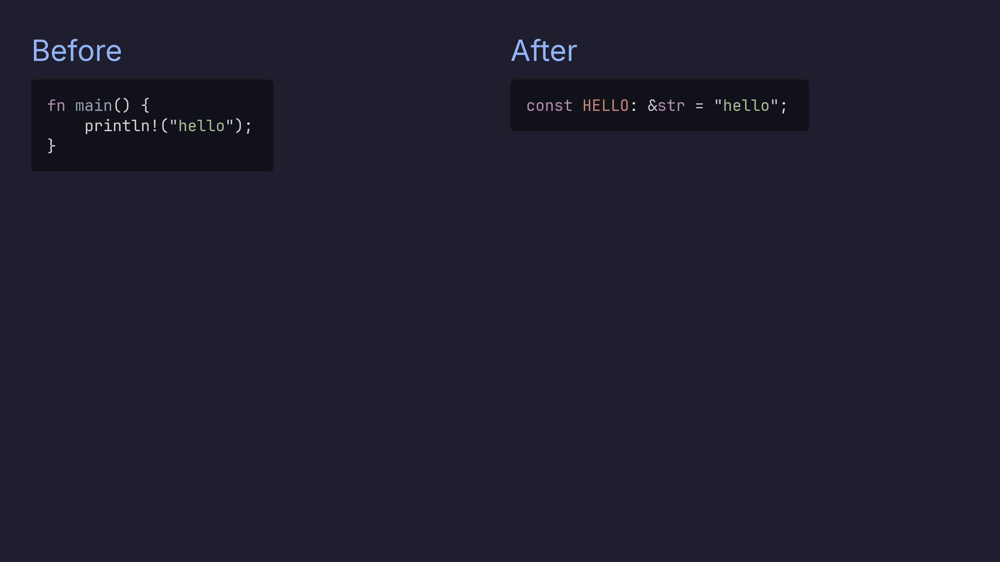
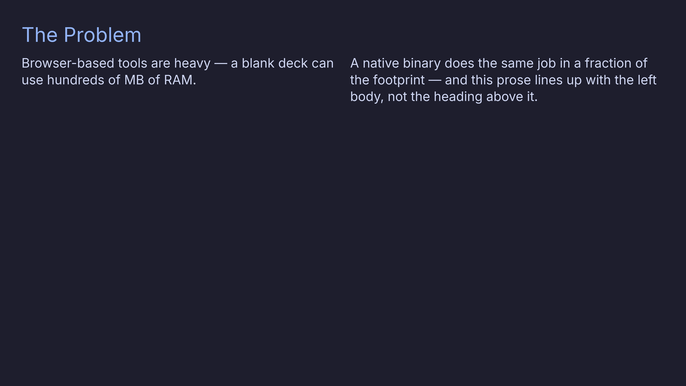

# Two-Column Layouts

Turn a slide into two columns with the `TwoColumn` layout directive, splitting
the content at a `***` line:

````markdown
<!-- layout: TwoColumn -->

## Before

```rust
fn main() {
    println!("hello");
}
```

***

## After

```rust
const HELLO: &str = "hello";
```
````

Everything before `***` is the left column; everything after is the right.



## Column ratios

By default the columns are equal width. Add a `left:right` ratio (positive
integers; `/` also works) to size them:

```markdown
<!-- layout: TwoColumn 2:1 -->
```

That makes the left column twice as wide as the right. A bare `TwoColumn` is
`1:1`; a malformed ratio falls back to `1:1`.

## Aligned headers

A leading heading in **either** column defines a shared "header band": preso
sizes the band to the taller heading and pushes the other column down to match,
so the bodies always line up — a one-line heading on one side and a two-line
heading on the other won't leave one body floating above the other. It's
automatic.

This also covers a heading on just **one** side. Give the left column a heading
and leave the right heading-less, and the right column's body still starts level
with the left body, under the same band — so a single heading effectively caps
both columns:

```markdown
<!-- layout: TwoColumn -->

## The Problem

Browser-based tools are heavy — a blank deck can use hundreds of MB of RAM.

***

A native binary does the same job in a fraction of the footprint — and this
prose lines up with the left body, not the heading above it.
```



> There's no slide-wide title *above* the two columns — a `##` before the `***`
> is just the left column's heading. For a shared banner, use a normal
> single-column slide before the two-column one.

> 💡 Both columns are full markdown — code, lists, images, math all work in
> either side. Code line-highlighting and `<!-- pause -->` steps work across the
> split too.
