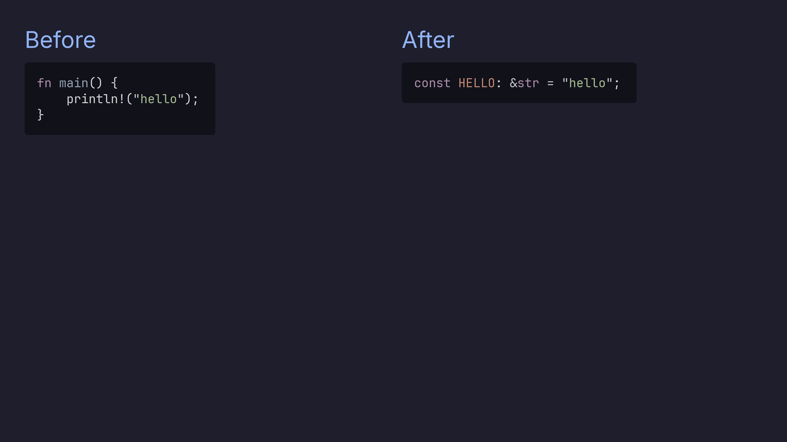
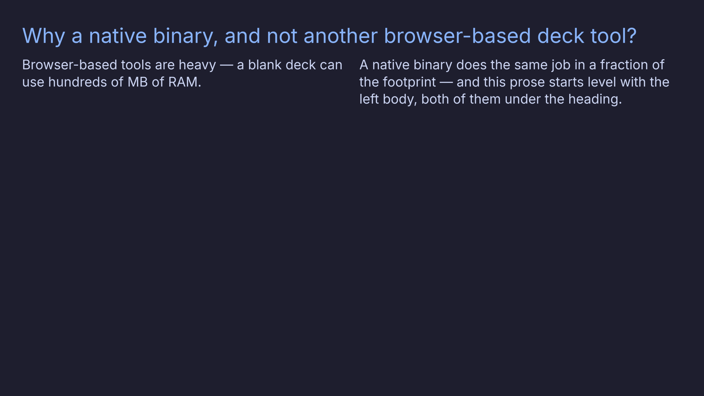

# Two-Column Layouts

Turn a slide into two columns with the `TwoColumn` layout directive, splitting
the content at a `***` line:

````markdown
<!-- layout: TwoColumn -->

## Before

```rust
fn main() {
    println!("hello");
}
```

***

## After

```rust
const HELLO: &str = "hello";
```
````

Everything before `***` is the left column; everything after is the right.



## Column ratios

By default the columns are equal width. Add a `left:right` ratio (positive
integers; `/` also works) to size them:

```markdown
<!-- layout: TwoColumn 2:1 -->
```

That makes the left column twice as wide as the right. A bare `TwoColumn` is
`1:1`; a malformed ratio falls back to `1:1`.

## Headings

Headings work two ways, and preso picks between them from what you write —
there's no directive for it.

**A heading on each side, at the same level,** is a per-column heading: both
stay in their columns, and preso sizes a shared "header band" to the taller of
the two, pushing the shorter one's body down to match. So a one-line heading on
one side and a two-line heading on the other still leave the bodies lined up.

**A heading on just one side** is the slide's heading, not that column's, so
preso lifts it out into a full-width band above *both* columns — where it can
use the whole slide width instead of wrapping inside one column — and the two
bodies start side by side underneath it:

```markdown
<!-- layout: TwoColumn -->

## Why a native binary, and not another browser-based deck tool?

Browser-based tools are heavy — a blank deck can use hundreds of MB of RAM.

***

A native binary does the same job in a fraction of the footprint — and this
prose starts level with the left body, both of them under the heading.
```



It works from either side: put the image on the left and the only heading on the
right and that heading still spans the slide. If you *want* a heading confined to
one column, give the other column a heading too — at the same level.

**A heading that outranks the other side's** is the slide's heading as well,
even though both columns start with one. The slide heading has to be written
somewhere, and the source only lets it start in the left column; a `##` above a
`###` opposite is unmistakably the slide's, so it spans, and the two `###`
headings left behind line up as column headings:

```markdown
<!-- layout: TwoColumn -->
## if (expr) {} else {}

### Pseudo code

...

***

### AArch64 assembly

...
```

Only the outranking heading moves. Anything under it stays that column's.

> 💡 Both columns are full markdown — code, lists, images, math all work in
> either side. Code line-highlighting and `<!-- pause -->` steps work across the
> split too.
